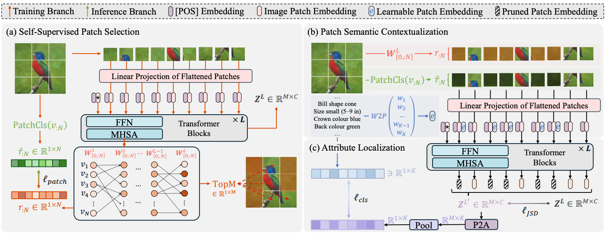

[//]: # (# SVIP)

[//]: # ([ICCV2025] Official Pytorch implementation for SVIP &#40;SVIP: Semantically Contextualized Visual Patches for Zero-Shot Learning&#41;)

<div align="center">
    
    <h2><strong>SVIP: Semantically Contextualized Visual Patches for Zero-Shot Learning</strong></h2>
</div>

<div align="center">
    <a href="https://uqzhichen.github.io/" target='_blank'>Zhi Chen</a><sup>1*</sup>&nbsp;&nbsp;&nbsp;
    <a href="https://github.com/JasonCodeMaker" target='_blank'>Zecheng Zhao</a><sup>2*</sup>&nbsp;&nbsp;&nbsp;
    <a href="https://jingcaiguo.github.io/" target='_blank'>Jingcai Guo</a><sup>3</sup>&nbsp;&nbsp;&nbsp;
    <a href="https://lijin118.github.io/" target='_blank'>Jingjing Li</a><sup>4</sup>&nbsp;&nbsp;&nbsp;
    <a href="https://staff.itee.uq.edu.au/huang/" target='_blank'>Zi Huang</a><sup>2</sup>
    </br></br>
    <sup>1</sup>University of Southern Queensland &nbsp;&nbsp;&nbsp;
    <sup>2</sup>University of Queensland &nbsp;&nbsp;&nbsp;
    </br></br>
    <sup>3</sup>The Hong Kong Polytechnic University&nbsp;&nbsp;&nbsp;
    </br></br>
    <sup>4</sup>University of Electronic Science and Technology of China&nbsp;&nbsp;&nbsp;
</div>

<br/>

<div align="center">
    <a href="https://arxiv.org/abs/2503.10252" target='_blank'>
        
    </a>&nbsp;
</div>





# :gear: Installation

```
pip install virtualenv
.\Master\Scripts\activate
```

# :hotsprings: Setup
- Tải dataset sau: [CUB](https://data.caltech.edu/records/65de6-vp158) và đặt vào ./data/.
- Tải metadata sau: [info-files](https://drive.google.com/file/d/1j7bHCOOR6Rug106UkPFhQLirDjYBo--z/view) và đạt vào ./info-files/.
- Các mô hình đã đào tạo trước đó: [Pre-moder](https://drive.google.com/file/d/1o1HRM8ZNnIp9CLPH0Y0E6W1N4xsr786c/view). Đặt trong ./pretrained_models/. 

# :bar_chart: Train

Trước tiên phải tạo ./attribute/w2v
```
python ./tools/extract_attribute_w2v_CUB.py
```

- Nếu chỉ muốn chạy thử nghiệm nhanh nhất:
```
python main.py --log_dir ./logs/SVIP_CUB_demo --epochs 1 --bs 256 --lr 3e-5 --num_workers 2 --test_interval 5
```

- Nếu muốn ra kết quả tốt nhất:
```
python main.py
```

# Cây thu mục
```
SVIP
├── __pycache__
├── attribute
│   ├── CUB
│   └── w2v
├── data
│   └── CUB_200_2011
│       └── CUB_200_2011
├── attributes.txt
├── docs
├── info-files
│   └── __MACOSX
│   ├── x-AWA2-data-image.pth
│   ├── x-CUB-data-image.pth
│   └── x-SUN-data-image.pth
├── logs
├── Master
├── models
├── pretrained_models
│   └── vit_base_patch16_224.pth
├── scripts
├── tools
├── .gitignore
├── dataset.py
├── main.py
├── README.md
└── vit_utils.py
```